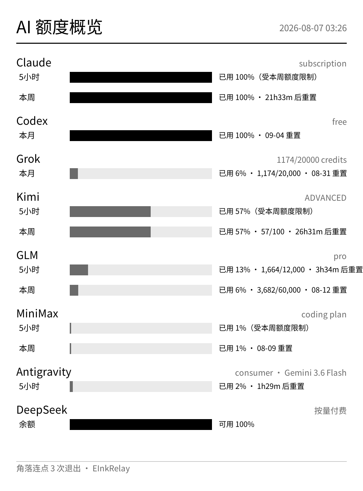
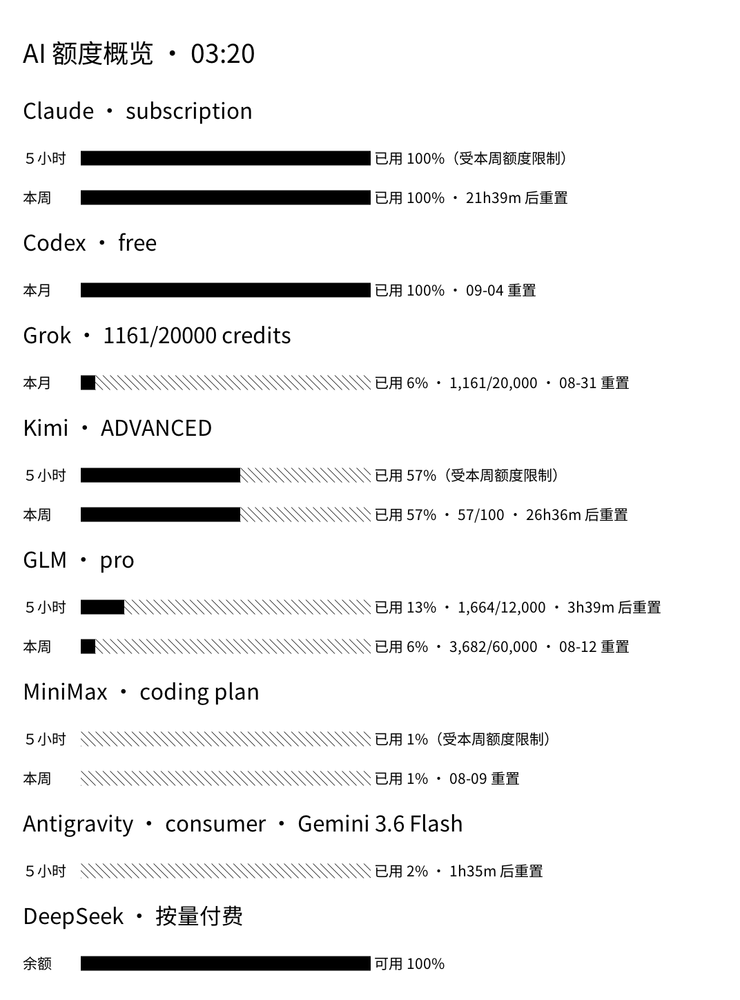

# 示例：在 Kindle 上展示一个仪表盘

这是「我想把一块仪表盘推到 Kindle 上」的完整实操示例。主示例是一个 **AI 额度仪表盘**：汇总本机 Claude、Codex、Grok、Kimi、GLM、MiniMax、Antigravity、DeepSeek、百炼九家编程服务的额度使用情况推到设备上。它是一个纯 Go 程序，代码在 [examples/quota-dashboard/](../examples/quota-dashboard/)，同时演示了「在 Kindle 上做仪表盘」的推荐做法。

面板支持两种显示格式，版式与文案完全一致，只换渲染链路：

- `-format image`（默认）：主机端渲染灰度 PNG，`PUT /v1/display/image`。版式像素级可控。
- `-format text`：主机只发一段 Markdown（约 2 KB），`PUT /v1/display/markdown`，设备端排版。进度条用块字符 `█`/`░`（每格 5%）。



## 运行

```sh
export EINKRELAY_HOST=192.168.15.244:8080
export EINKRELAY_TOKEN=$(ssh root@192.168.15.244 'cat /var/local/einkrelay/token')

# 仅 image 模式需要：一个本地 CJK 字体文件（仓库不提交字体二进制；
# 固定字体及其校验 URL 见 assets/fonts/manifest.json）
export DASHBOARD_FONT=/path/to/NotoSansCJKsc-Regular.otf

cd examples/quota-dashboard
go run .                          # image 模式：查询九家额度 → 渲染 PNG → 推送
go run . -format text             # text 模式：推送 Markdown，设备端排版
go run . -o out.png               # image 只写本地文件（调版面时用）
go run . -format text -o out.md   # text 只写本地 Markdown
```

GLM、MiniMax、DeepSeek 走按量 API key，程序从环境变量 `ZHIPUAI_API_KEY`（或 `GLM_API_KEY`）、`MINIMAX_API_KEY`、`DEEPSEEK_API_KEY` 读取；其余五家用本机 CLI 已登录的凭据，不需要额外配置。百炼两样都要：环境变量 `BAILIAN_API_KEY`（或 `DASHSCOPE_API_KEY`）决定这一格出不出现，额度本身要先跑一次 `bl auth login --console`（原因见下文）。某一家查不到（未登录、未设 key、网络失败）时面板照常渲染，该服务显示「查询失败」一行，不影响其他家。

### 快速测试显示功能（无需构建）

仓库自带两个可直接推送的示例文件——[examples/dashboard.png](../examples/dashboard.png)（图片端点）和 [examples/dashboard.md](../examples/dashboard.md)（Markdown 端点，即 text 模式的真实产物）：

```sh
export KINDLE=192.168.15.244
export TOKEN=$(ssh root@$KINDLE 'cat /var/local/einkrelay/token')

curl -X PUT -H "Authorization: Bearer $TOKEN" -H "Content-Type: image/png" \
  --data-binary @examples/dashboard.png "http://$KINDLE:8080/v1/display/image?fit=contain"

curl -X PUT -H "Authorization: Bearer $TOKEN" -H "Content-Type: text/markdown; charset=utf-8" \
  --data-binary @examples/dashboard.md "http://$KINDLE:8080/v1/display/markdown?font_size=21"
```

## 九家的额度从哪来

所有端点都在本机实测可用；凭据只从本机既有位置读取，程序不打印、不上传它们，请求全部发往各服务的官方域名。

| 服务 | 凭据来源 | 查询端点 | 窗口 |
| --- | --- | --- | --- |
| Claude | macOS Keychain「Claude Code-credentials」（Linux 回退 `~/.claude/.credentials.json`） | `api.anthropic.com/api/oauth/usage` | 5 小时 / 本周 |
| Codex | `~/.codex/auth.json` | `chatgpt.com/backend-api/wham/usage` | 按订阅周期 |
| Grok | `~/.grok/auth.json` | `cli-chat-proxy.grok.com/v1/billing?format=credits`（周/月额度池，与 CLI `/usage` 同源）+ `/v1/billing`（月度 API credits） | 本周（统一计费）/ 本月（API credits） |
| Kimi | `~/.kimi-code/credentials/kimi-code.json` | `api.kimi.com/coding/v1/usages` | 5 小时 / 本周 |
| GLM | 环境变量 `ZHIPUAI_API_KEY` | `open.bigmodel.cn/api/monitor/usage/quota/limit` | 5 小时 / 本周 |
| MiniMax | 环境变量 `MINIMAX_API_KEY` | `api.minimaxi.com/v1/api/openplatform/coding_plan/remains` | 5 小时 / 本周 |
| Antigravity | macOS Keychain（service「gemini」/ account「antigravity」，agy CLI 写入） | `daily-cloudcode-pa.googleapis.com/v1internal:fetchAvailableModels` | 按模型族，各自带重置时间 |
| DeepSeek | 环境变量 `DEEPSEEK_API_KEY` | `api.deepseek.com/user/balance` | 无窗口；以 ¥1000 为满额基准换算已用/可用% |
| 百炼（Bailian） | 环境变量 `BAILIAN_API_KEY` 只当开关；额度凭据取 `~/.bailian/config.json` 的 `access_token`（`bl auth login --console` 写入） | `bailian-cs.console.aliyun.com/cli/api.json` 控制台网关，API `zeldaHttp.apikeyMgr./tokenplan/personal/api/v2/usage`（+ `/subscription` 取套餐档位）；没有付费套餐时退回 `zeldaEasy.bailian-commerce.freeTrial.queryFreeTierQuota` | 本周（Token Plan 订阅额度）；退回免费额度时无窗口 |

注意各家口径不同：

- Claude / GLM / Kimi 返回「已用百分比」，MiniMax 返回「剩余百分比」（程序换算成已用），Grok 统一计费用户返回周额度池百分比（`creditUsagePercent`），另附月度 API credits 的已用/总额。面板一律统一成「已用百分比 + 重置倒计时」展示。
- **Grok 的坑**：裸 `/v1/billing` 只给月度 API credits，对 SuperGrok / X Premium+ 等统一计费用户**不是**限制 Build 的那条额度；真正的周额度池在 `?format=credits`（与 Grok CLI `/usage` 同源，`currentPeriod.type=USAGE_PERIOD_TYPE_WEEKLY`）。程序两路都查，周额度池优先展示。
- **绝对量（已用/总额）只有部分服务提供**：Grok 月度 API credits、Kimi、GLM（额度点数）会返回，直接并进条后文字（如「已用 53% · 53/100」）；Grok 周额度池、MiniMax（多数情况）、Claude、Codex、Antigravity 服务端只给百分比——没有绝对量不是程序没做，是上游没有数据。
- DeepSeek 是按量账户，没有窗口与重置概念，面板上也**不显示具体金额**：以 `deepSeekBalanceFull`（默认 ¥1000）为满额基准线性换算——余额 ≥ ¥1000 显示「已用 0% · 可用 100%」；余额 ¥900 显示「已用 10% · 可用 90%」；余额 0 显示「已用 100% · 可用 0%」。进度条与其它服务一致按「已用」填充。
- **百炼是唯一一家额度查不到模型域接口上的**：`sk-` / `sk-sp-` 这类 API key 只能调模型，用量端点实测一律 404（`/v1/usage`、`/v1/billing`、`/api/v1/subscription`、`/apps/anthropic/api/oauth/usage`），响应头里也没有 credits 信息，官方文档同样只让在控制台页面看用量。程序因此走 `bl` CLI 同源的控制台网关（`bl usage free` 用的就是它），凭据是 `bl auth login --console` 落在 `~/.bailian/config.json` 里的 `access_token`——只读、不刷新、不回写，过期时重新跑一次 `bl auth login --console`；会话失效时面板会直接把这句提示写在该行上。`BAILIAN_API_KEY`（或 `DASHSCOPE_API_KEY`）只用来判断这一格要不要出现在面板上，和其它按量服务的口径一致。网关上的接口名有两种形态：`bl` 用的 `zeldaEasy.<服务>.<模块>.<方法>`，以及控制台自己用的 `zeldaHttp.<服务>.<HTTP 路径>` 路径代理。**Token Plan 的订阅额度只在后者上**——`zeldaHttp.apikeyMgr./tokenplan/personal/api/v2/usage` 返回 `per1WeekPercentage`（0–1 的比例，控制台「套餐额度」那根条乘 100 显示）和 `per1WeekResetTime`，`/subscription` 返回套餐档位与剩余天数（面板放在厂商标题行，如 `Token Plan lite · 剩余 364 天`），`/addon/summary` 是额外用量包的 credits（没接进面板：它不受周额度约束，混进窗口列表会被下面的嵌套额度规则误标成「受本周额度限制」）。这些接口名在 `bl` CLI 和公开文档里都没有，是从控制台页面的实际请求里认出来的。账号没有付费套餐时（按量账户）程序退回免费额度：按模型单独发放、没有账号级总额，查 `bailianModels`（默认 `qwen3.8-max` / `qwen3.7-plus` / `qwen3-coder-plus`）里剩余比例最低的那个，模型名与到期日放标题行。另外配置里的 `console_switch_agent`（主子账号/代运维切换）要跟着带进网关参数 `cornerstoneParam.switchAgent`，否则切换过账号的用户会查到别的账号头上——`bl` 自己就是这么做的。
- **嵌套额度的展示规则**：5 小时 ⊂ 本周 ⊂ 本月。短周期的实际可用额度受所有更长周期约束——周额度用尽时，5 小时窗口即便自己的计数为零也照样不可用。因此短周期行的展示值取 `max(自身已用%, 更长周期已用%)`，被覆盖的行标注「受本周/本月额度限制」，自身重置时间与原始计数不再展示（能否使用取决于长周期，其数值见对应长周期行）。
- Antigravity 的额度挂在**每个模型**上（`quotaInfo.remainingFraction`），同一模型的高/中/低推理档共享一族额度：程序按展示名聚合成模型族，然后**只展示最新模型的那一族**，与其他厂商的单一额度口径保持一致；其重置点实测固定在约 5 小时周期的边界上，因此行标签是「5小时」，模型名显示在厂商标题行。agy 的 access_token 过期时程序会用 Keychain 里的 refresh_token 现场换新（只在内存使用，不回写）；刷新所需的 OAuth client id/secret 是 Antigravity 分发给每个用户的 installed-app 凭据，程序从本机 agy 二进制里现找，不落盘在代码库中。
- 一个实测到的坑：Antigravity 的 `v1internal` 端点对不带 `User-Agent` / `X-Goog-Api-Client` 的请求一律回 429，程序已带上。

## 两种显示格式怎么选

这个仓库的 Markdown 端点有三个硬限制：

1. **没有 GFM 表格。** 服务端是 CommonMark 核心、不启用任何扩展，`|---|` 表格语法会原样显示成一堆竖线。
2. **粗体/等宽都回退到比例字体。** 字体 manifest 只钉了一个 face（Noto Sans CJK SC Regular），`mono` / `bold` / `italic` 三个角色全部回退到 regular，`**粗体**`看不出粗，ASCII 空格填充的跨行对齐也不成立（连续空格还会被 Markdown 折叠）。
3. 但**全角字符与块字符在该字体里精确等于 1 em**——这是 text 模式对齐的立足点。



text 模式的绕法（`markdown.go`）：进度条用块字符 `█`/`░`（整 1 em、每格 5%，同行内不涉及跨行对齐）；标签列把 ASCII 转成**全角形式**（`5`→`５`）再用全角空格 U+3000 补齐到统一 em 宽度——标签列、进度条列、数值列因此逐行像素级对齐，与比例字体无关，也不靠制表符。

**怎么选**：要像素级精确的条长和版式 → image；要极小payload、设备端自排版、或不方便准备字体文件 → text。两者数据与文案一致（共享 `tailOf`）。纯文字/清单类的极简需求也可以直接 curl Markdown 端点，见 [examples/dashboard.sh](../examples/dashboard.sh)。

## 图片路线的三个关键做法

**① 用 `/v1/status` 的 `screen` 定画布尺寸，不要硬编码。** 画布与面板尺寸完全一致时 `fit=contain` 是 1:1 显示，不发生任何重采样。硬编码 1072×1448 在 PW4 上也对，但换设备就废了（程序在未接设备的 `-o` 模式下才用这个默认值兜底）。

**② 灰阶面板的设计规则，和彩色图表不一样：**

- **系列身份绝不能靠灰度区分**——相邻灰阶在墨水屏上几乎分不出来。每条用量都直接标百分比与重置时间，灰度只用于强调（用量 ≥90% 的条用纯黑）。
- **只用少数几档、彼此拉开**。示例用四档平色（`0x00 / 0x6A / 0xEA / 0xFF`）。墨水屏抖动渐变很难看，细腻的色阶会变成泥。
- **不画网格**；信息都靠直接标注，不靠读图猜数。

**③ 推送就是一次 `PUT /v1/display/image?fit=contain`**，几十 KiB 的 PNG 足够装下整块信息密集的面板。

## 刷新成本与节奏（PW4 实测）

```
主机渲染 PNG        ~35 ms
推送 + 设备显示     ~650 ms   (37 KiB)
合计                ~690 ms
```

据此安排刷新循环：

- **不要秒级刷新。** 每次 PUT 都是一次整屏电子墨水刷新，会闪一下，还耗电、磨面板。**1–5 分钟**是合理区间；额度这类慢变量 15–30 分钟刷一次都够。
- **服务不排队。** 并发推送会拿到 `409 display_busy`；刷新循环要自己串行，遇到 409 稍后重试即可。
- 设备必须处于**独占模式**（KUAL「EInkRelay: 启动」或 `/mnt/us/einkrelay/start.sh`）；面板已还给原生界面时推上去的内容不可见。退出方式见 [api-examples.md](api-examples.md)。

## 自动刷新

程序内置 `-every` 循环：每过指定间隔重新查询、渲染、推送，**image 与 text 两种模式都支持**；单轮失败（设备离线、409、某家接口抖动）只记日志不退出，下一周期自动重试。

```sh
cd examples/quota-dashboard && go build -o quota-dashboard .

EINKRELAY_HOST=192.168.15.244:8080 \
EINKRELAY_TOKEN=$(ssh root@192.168.15.244 'cat /var/local/einkrelay/token') \
DASHBOARD_FONT=/path/to/NotoSansCJKsc-Regular.otf \
nohup ./quota-dashboard -every 5m >> /tmp/quota-dashboard.log 2>&1 &
```

GLM / MiniMax / DeepSeek / 百炼的 API key 从环境变量读，后台启动前确保当前 shell 已加载（如 `source ~/.zshenv`）。停止循环：`kill` 该进程即可；`nohup` 让进程在终端关闭后继续运行，但 Mac 重启后需要重新拉起（要开机自启可以自行包一层 launchd）。
